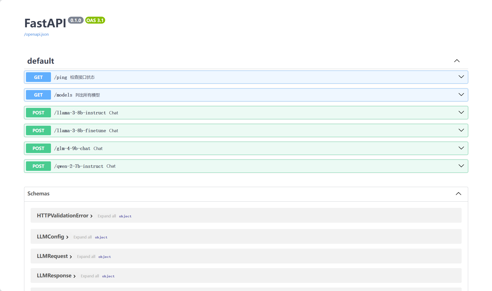

# OmniLLM

<div align="center">
    <a href="https://github.com/sastpg/OmniLLM/tree/main">
        
    </a>
    <a href="https://github.com/sastpg/OmniLLM/blob/main/LICENSE">
        
    </a>
</div>

⚡ Build open-source large language model(LLM) service ⚡

Read this in [English](README_en.md)


## 项目更新

- ``2024/07/14``: 支持模型流式输出。
- 🔥 ``2024/07/08``: 实现工具调用（也叫函数调用）的 API 支持，更多调用细节请前往 [查看]()。
- 🔥 ``2024/06/17``: 支持 LLaMA3, Qwen2, GLM4 以及它们微调后模型的 API 调用，发布在网站中使用的简单示例。

## 快速开始
### Python 环境
推荐您使用 Conda 进行 python 包管理，关于如何安装和使用 Conda 请见[Conda 官方文档](https://conda.io/en/latest/index.html)。

1. 克隆本仓库并进入项目文件夹
```bash
git clone https://github.com/sastpg/OmniLLM.git
cd OmniLLM
```

2. 安装 Python 包
```bash
conda create -n omnillm python=3.12
conda activate omnillm
cd service  # 模型 API 服务
pip install -r requirements.txt
cd ../web  # 以下命令可不执行，如果您只需要 API 服务而不需要网页 Demo
pip install -r requirements.txt
```

### 模型下载
1. 在魔塔（强烈建议中国大陆的用户使用魔塔）或者 Huggingface 上下载 LLaMA3-8B，GLM4-9B，Qwen2-7B 等模型，本步骤耗时较久，可以选择需要的模型下载：
```bash
cd ..  # 进入项目文件夹根目录
git clone https://www.modelscope.cn/LLM-Research/Meta-Llama-3-8B-Instruct.git
git clone https://www.modelscope.cn/qwen/Qwen2-7B-Instruct.git
git clone https://www.modelscope.cn/ZhipuAI/glm-4-9b-chat.git
```
2. 进入 `config/config.json` 文件进行配置：
```json
{
    "CUDA_VISIBLE_DEVICES": "0, 1, 2",  // 显卡资源
    "models":{
        "llama-3-8b-instruct": "../models/Meta-Llama-3-8B-Instruct",  // 模型文件的路径
        "glm-4-9b-chat": "../models/glm-4-9b-chat",
        "qwen-2-7b-instruct": "../models/Qwen2-7B-Instruct"
    },
    "port": 8001  // API 服务的端口号
}
```

### 🤖 模型 API 服务
```bash
cd service
python main.py
```

启动模型 API 服务后，访问 http://localhost:8001/docs 如下所示（如在服务器上部署，将 localhost 替换为服务器公网 IP）：



### 🖥️ 网页 Demo
一个简单的用户交互界面，调用 模型 API 服务生成回答，并展示在网页上。
```bash
cd ../web
streamlit run chat.py --server.port 8601
```

命令运行后，点击下方的链接即可访问网页。

## API 调用
您可以通过 HTTP 调用接口来使用模型，实现单轮对话、多轮对话、流式输出、工具调用等多种功能。本项目也提供了 Python 接口调用的方式来使用，代码如下：

```python
def call_llm(model_name, messages, tools=None, **kwargs):
    url = f"http://localhost:8001/{model_name}"
    message = {
        "messages": messages,
        "tools": tools,
        "llm_config": kwargs
    }
    print(model_name, message)
    resp = requests.post(url, json=message)
    return resp.json()
```
### 参数说明
💡 以下说明仅针对 Python 接口，更多细节请见详细文档。

| 参数                   | 数据类型   | 默认值 | 说明                                                         |
| ---------------------- | ---------- | ------ | ------------------------------------------------------------ |
| model_name（必选）     | string     | 无     | 指定用于对话的通义千问模型名，目前可选择 `llama-3-8b-instruct`、`llama-3-8b-finetune`、`glm-4-9b-chat`、`qwen-2-7b-instruct`。 |
| messages（必选）       | list[dict] | 无     | 用户与模型的对话历史。list 中每个元素形式为`{"role":角色, "content": 内容}`，角色当前可选值为 `system`、`user`、`assistant`和`tool`。 |
| stream（可选）         | boolean    | False  | 用于控制是否使用流式输出。                                   |
| do_remember（可选）    | boolean    | True   | 模型记忆能力和多轮对话能力。                                 |
| tools（可选）          | list[dict] | None   | 用于指定可供模型调用的工具库，一次工具调用流程模型会从中选择其中一个工具。 |
| top_p（可选）          | float      | 0.9    | 生成过程中的核采样方法概率阈值，例如，取值为0.8时，仅保留概率加起来大于等于0.8的最可能token的最小集合作为候选集。 |
| top_k（可选）          | integer    | 50     | 生成时，采样候选集的大小。例如，取值为50时，仅将单次生成中得分最高的50个 token 组成随机采样的候选集。 |
| temperature（可选）    | float      | 0.7    | 用于控制模型回复的随机性和多样性。具体来说，temperature 值控制了生成文本时对每个候选词的概率分布进行平滑的程度。取值范围：[0, 1)，不建议取值为0，无意义。 |
| max_new_tokens（可选） | integer    | 512    | 控制模型生成的最大 token 数。                                |

### 调用示例

- **多轮对话：**

```python
messages = [
    {
        "role": "system",
        "content": "你是一个乐于解答各种问题的助手，你的任务是为用户提供专业、准确、有见地的建议。"
    },
    {
        "role": "user",
        "content": "你好，你是谁？"
    }
]
resp = call_llm("qwen-2-7b-instruct", messages=messages)
print(resp)
```
模型回复格式如下：
```json
{
  "status": 0,
  "data": {
    "role": "assistant",
    "content": "你好！我是一个AI助手，专门用来帮助解答各种问题、提供信息和进行对话。无论你需要学术指导、日常建议还是娱乐内容，我都在这里为你服务。有什么我可以帮助你的吗？",
    "tool_calls": None
  }
}
```

- **工具调用：**

```python

```