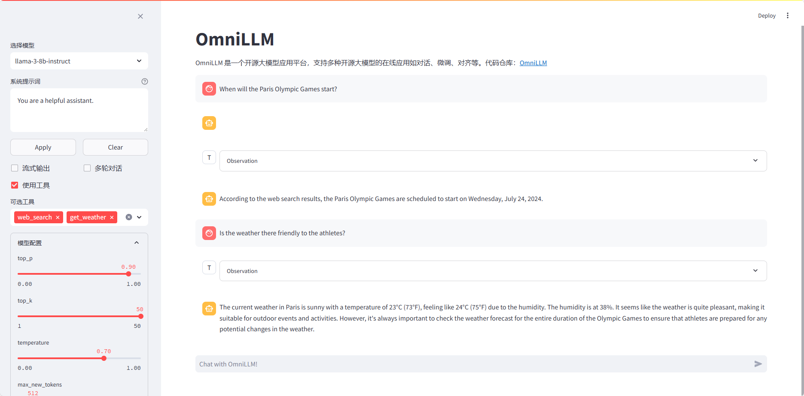

# OmniLLM

    
    

⚡ Build open-source large language model(LLM) service ⚡

Read this in [Chinese](README.md)

## News

- 🔥 ``2024/07/08``: Add API supports for tool call(also known as function call), see more detials [here]().
- 🔥 ``2024/06/17``: Support API calls for LLaMA3, Qwen2, GLM4 and their fine-tuned models, and publish simple web demo for easy interaction.

## Quickstart
